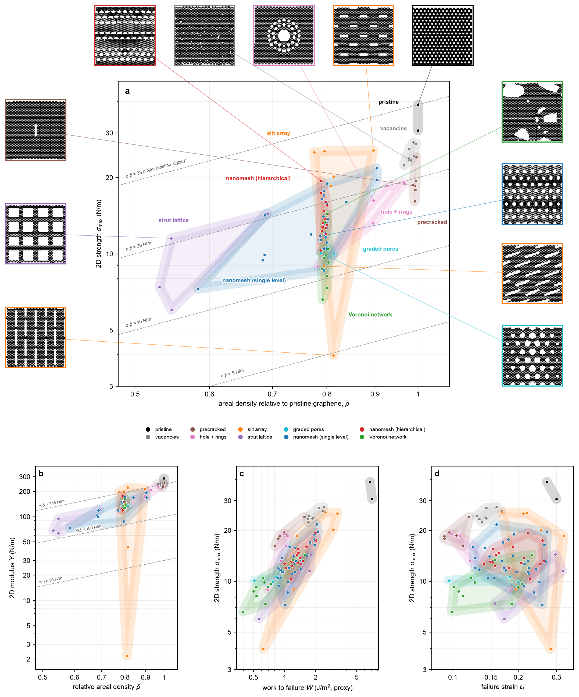
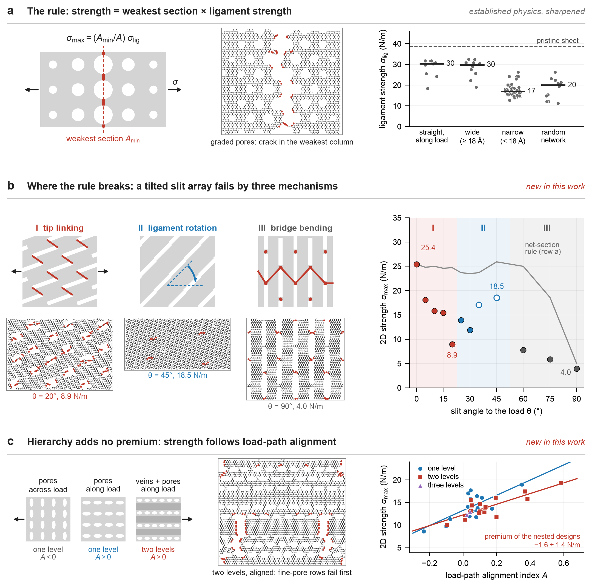
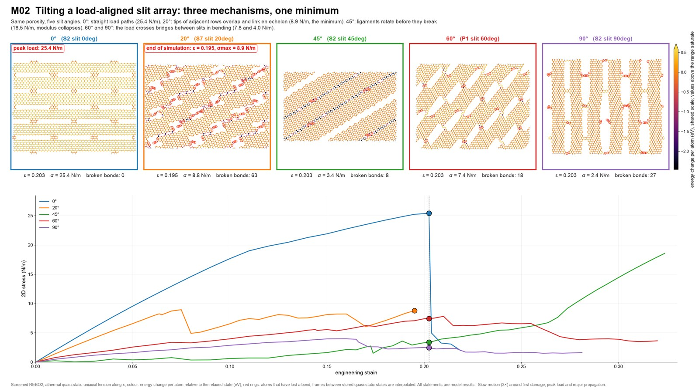

# A model builds a model: an AI agent constructs a validated atomistic instrument and uses it to discover what sets the strength of architected graphene

This repository is the complete, reproducible record of an experiment in autonomous science. A large language model
(Claude Fable 5.1, run as an autonomous agent in Claude Code) was given **one prompt** and five reference images. From
that prompt it wrote, from scratch, a PyTorch implementation of the screened second-generation REBO potential for carbon,
validated it against the published Fortran reference to 10⁻¹³ eV/atom, built a platform for generating, loading and
analysing atomically resolved graphene architectures, and ran a hypothesis-driven campaign of quasi-static tensile
simulations across ten architecture families at matched mass, ending with twelve holdout designs whose properties it
predicted and hashed before simulating them. In a second phase a human scientist questioned the results and directed
further analysis and 18 additional simulations, again pre-registered under two competing rules.

Everything here is a **model result** (screened REBO2, athermal quasi-static loading). No claim is made about real
materials, synthesizability, or experimental fracture toughness; "work to failure" is the area under a stress–strain
curve, a proxy.

**Manuscript:** *A model builds a model: an AI agent constructs a validated atomistic instrument and uses it to discover
what sets the strength of architected graphene*, M. J. Buehler, 2026 (arXiv link to be added).
**Data on Hugging Face:** all 132 raw trajectories and the large SVG figures are hosted at
`https://huggingface.co/datasets/lamm-mit/graphene-agent-data` (see [Getting the data](#getting-the-data)).

---

## What is in this repository

| folder | phase | content |
|---|---|---|
| [`prompt/`](prompt/) | 1 → 2 | the verbatim prompt that started the experiment, the five reference images it referred to, and every follow-up request of the human collaborator with timestamps |
| [`carbon_discovery/`](carbon_discovery/) | 1 (+ additions in 2) | the platform the agent built: force engine, neighbour list, minimiser, loading driver, structure generators, descriptors, validation suite (20 tests with results), the experiment database (132 records with structures and stress–strain curves), campaign scripts, prediction files with hashes, figures, fracture movies, the browser app, and the agent's 54-page report |
| [`paper_analysis/`](paper_analysis/) | 2 | the human-directed analysis for the paper: figure scripts with an automatic text-overlap audit, the alignment index, the pre-registered sweep design and its evaluation, all paper and SI figures (PNG, PDF, SVG) |
| [`slides/`](slides/) | 2 | three talk slides (mechanisms, mechanisms with data, the force engine) and their generators |
| [`PROVENANCE.md`](PROVENANCE.md) | | timeline, what was produced when, which files inside `carbon_discovery/` post-date the autonomous phase, integrity hashes |

## The experiment in brief

**Phase 1, one prompt (4–6 September 2026).** The prompt ([`prompt/original_prompt.md`](prompt/original_prompt.md),
46,000 characters) fixed the physics and the discipline: mechanics only from the published screened REBO2 potential
with the Atomistica implementation as the authoritative reference and no parameter changes; no springs, beams,
continuum models or learned surrogates; GPU execution only if proven exact; 2D stress in N/m; model results, never
material claims; hypotheses and discriminating experiments; predictions for unseen structures written before
simulation. The agent worked for about 30 hours without intervention (the human's only messages in that period were
progress checks) and delivered:

- a force engine in PyTorch that agrees with the Fortran reference to 6×10⁻¹⁴ eV/atom in energy and 4×10⁻¹³ eV/Å in force,
  with a float32 GPU mode within 7×10⁻⁶ eV/atom, 1.5×10⁻⁴ eV/Å and 4×10⁻⁵ N/m, and a complete loading curve through fracture
  identical to the reference to 10⁻¹⁰ N/m under the same minimiser; 20 validation tests, all passed
  ([`carbon_discovery/validation/results/validation_table.json`](carbon_discovery/validation/results/validation_table.json));
- about 7,000 lines of new code (engine, neighbour list, FIRE, quasi-static driver, MD, generators, descriptors, database,
  job queue, analysis, app), with an honest benchmark: the GPU port is about 3× *slower* per call than the Fortran
  reference on the Apple M4 Max it ran on, and was used for batching, per-atom virials, autograd stresses and
  multi-process concurrency;
- a campaign of 96 discovery simulations plus 17 convergence tests in seven stages (baselines, reconnaissance,
  hypotheses, discriminating matched pairs, mechanism studies, seed replicates, holdouts), a machine-readable database,
  publication figures, fracture movies, a browser app and a compiled report
  ([`carbon_discovery/report/report.pdf`](carbon_discovery/report/report.pdf)).

**Phase 2, a conversation (6–18 September 2026).** The human collaborator asked for a chart of the design space, a
check of novelty against the literature, a measurable definition of load-path alignment, a quantitative test of whether
hierarchy is a free lunch, paper figures, and slides. The agent answered with new analyses and with 18 further
simulations whose outcomes it predicted from two competing rules and hashed before launching them
([`prompt/phase2_requests.md`](prompt/phase2_requests.md)). All 132 simulations together took 287 process-hours on one
Apple M4 Max.

## Headline results (all in the model)

Numbers below are regenerated from the database by [`paper_analysis/make_figures.py`](paper_analysis/make_figures.py)
and exported as LaTeX macros ([`paper_analysis/figures/numbers.tex`](paper_analysis/figures/numbers.tex)).

1. **Strength is not a rule of mixtures; modulus nearly is.** At a relative areal density of 0.8 the specific strength
   spans a factor of 6.6 across families (4.9 to 32.5 N/m; pristine zigzag graphene: 38.8 N/m), while the specific
   modulus stays within 110–274 N/m for all but two designs.
2. **Load paths, not mass, separate the families.** Strength correlates weakly with density (r = 0.44) and strongly with
   the minimum load-bearing section combined with the ligament class (r = 0.77). Only load-parallel slit arrays keep
   more than 80 % of the pristine specific strength.
3. **Tilting a load-aligned slit array moves it through three failure mechanisms.** En-echelon linking of overlapping slit
   tips with a strength minimum at 20° (8.9 N/m, a third of the untilted value), rotation of the ligaments between rows at
   25–45°, and bending of the bridges between slits beyond 60°. A pre-registered control without tip overlap kept 78 % of
   the untilted strength; the third regime was anticipated by neither rule.
4. **Hierarchy is not a free lunch.** With a load-path alignment index computed from the structure tensor of the solid
   phase, 40 nested and single-level meshes fall on one trend (r = 0.69), and nested meshes sit 1.6 ± 1.4 N/m below the
   single-level trend at equal alignment. Hierarchy buys alignment, and buys it more expensively than shaping the pores.
5. **Disorder, gradients and flaw halos are costs** relative to the ordered mesh at the same porosity, with seed replicates.
6. **The misses are the mechanisms.** Across 30 hashed predictions (12 holdouts, 18 sweeps) the rules were accurate
   wherever their mechanism applied (median strength error 14 % for the holdouts, 11 % for the alignment sweep) and
   wrong exactly where another mechanism operated.



*Ashby-style chart of all discovery simulations: 2D strength against relative areal density with one envelope per
architecture family and thumbnails of the relaxed structures. Generated by `carbon_discovery/analysis/ashby_chart.py`.*



*The mechanisms, with schematics drawn to scale from the generator parameters. Generated by `paper_analysis/mechanism_figure.py`.*

## Fracture movies

Ten synchronised, high-resolution movies (H.264, 2560×1440 masters and 1920×1080 versions) cover the design space and
the mechanisms: baselines, the slit-angle series with its three regimes, the pre-registered tip-overlap control,
hierarchy level by level, the alignment sweep, the costs of disorder and gradients, the flaw halo, progressive versus
avalanche failure, and two close-ups. All panels of a movie advance at the same strain, with slow motion around first
damage, peak load and major propagation; frames between stored quasi-static states are interpolated and marked as such.
They are generated from the database by [`paper_analysis/make_movies.py`](paper_analysis/make_movies.py); the captions,
a LaTeX snippet for supplementary information and JPEG posters are in
[`paper_analysis/movies_hq/`](paper_analysis/movies_hq/), the MP4 files on Hugging Face
(`python scripts/fetch_data_from_huggingface.py --what movies`).



## Reproducing

### Environment
Python 3.12 with PyTorch ≥ 2.7, ASE, Atomistica (the Fortran reference, used only by the validation scripts), NumPy,
SciPy, Matplotlib, FastAPI/uvicorn (app), PyMuPDF (SVG export of the TikZ figure), pytest. The campaign ran on Apple
silicon (MPS); CUDA and CPU code paths are identical, CUDA is unbenchmarked.

```bash
conda env create -f environment.yml && conda activate graphene-agent
# or: pip install -r requirements.txt
cd carbon_discovery && python -m pytest -q tests/        # 10 tests, about 10 s
```

### Getting the data
The repository contains every record of the database (parameters, descriptors, metrics, relaxed/initial/final structures,
stress–strain curves) and the 17 raw trajectories that the figure, movie and slide scripts read. The other 115
trajectories (about 4 MB each, positions, cells, per-atom energies and virials, bond lists per frame) and the 47 SVG
files larger than 3 MB (atom-resolved fracture panels) are on Hugging Face:

```bash
pip install huggingface_hub
python scripts/fetch_data_from_huggingface.py --what all      # or: trajectories | svg
```

### Regenerating results
```bash
cd carbon_discovery
python validation/suite.py                     # validation table (fast tests)
python analysis/campaign_analysis.py           # campaign figures from the database (needs all trajectories)
python final_designs/select_top.py             # top structures, fracture panels, movies (ffmpeg)
python report/results_body_template.py && python report/build_report.py    # the report (latexmk)
./scripts/launch_app.sh                        # browser app at http://127.0.0.1:8766
python scripts/reproduce_run.py <run_id>       # rerun one stored simulation from its record

cd ../paper_analysis
./build_figures.sh                             # paper + SI figures, overlap audit, macros (about 10 min)
```

To rerun the campaign itself, the batch specifications are in `carbon_discovery/experiments/specs/` and run with
`scripts/run_batch.py` or the queue `scripts/run_queue.py` (one process per structure, several sharing the GPU); each
stage took hours to a day on one machine.

## Integrity and pre-registration

- Every simulation record stores device, precision, force-field parameter checksum, boundary conditions, minimiser
  settings, strain increments, seeds and dates; `carbon_discovery/manifest.json` lists every file with its SHA-256.
- Round 1: `carbon_discovery/experiments/predictions/holdout_predictions.json` was written 2026-09-05 21:20:34 (content
  hash `2eb2d80a…`); the first holdout simulation started at 21:52; the evaluation is in
  `experiments/holdouts/holdout_evaluation.json`.
- Round 2: `experiments/predictions/paper_sweeps_predictions.json` was written 2026-09-09 04:54:27 (`51891202…`); the
  18 sweeps ran 05:48–10:34; the evaluation is in `experiments/holdouts/paper_sweeps_evaluation.json`.
- Thirteen early records carry the flag `reconstructed_from_trajectory`: during phase 1 the agent accidentally deleted
  their record files and rebuilt them from the stored trajectories and logs; the trajectories themselves were never lost.
  See [`PROVENANCE.md`](PROVENANCE.md).

## Citation

If you use this code or data, please cite the manuscript (see [`CITATION.cff`](CITATION.cff)) and the potential:
Brenner et al., *J. Phys.: Condens. Matter* 14, 783 (2002); Pastewka et al., *Phys. Rev. B* 78, 161402(R) (2008)
and 87, 205410 (2013); Atomistica, https://github.com/Atomistica/atomistica.

## License

Everything in this repository and in the companion dataset (code, database, trajectories, structures, figures, movies,
report, prompt and conversation record, slides) is released under the **Apache License 2.0** ([`LICENSE`](LICENSE)).
Third-party components and their licenses: [`THIRD_PARTY_NOTICES.md`](THIRD_PARTY_NOTICES.md).

## Acknowledgement

Phase 1 was carried out autonomously by Claude Fable 5.1 (Anthropic) in Claude Code; phase 2 by the same agent under
the direction of the human author. The human author is responsible for the scientific claims.
